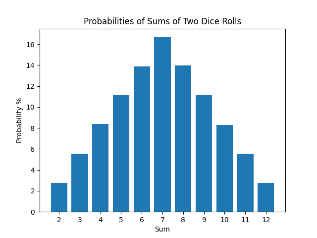

# Аналітична ймовірність

Кожна сума (від 2 до 12) має визначену ймовірність, що базується на кількості способів, якими її можна отримати з двох
кубиків:

| Сума | Варіанти                                 |
|------|------------------------------------------|
| 2    | `1+1`                                    |
| 3    | `1+2`, `2+1`                             |
| 4    | `1+3`, `2+2`, `3+1`                      |
| 5    | `1+4`, `2+3`, `3+2`, `4+1`               |
| 6    | `1+5`, `2+4`, `3+3`, `4+2`, `5+1`        |
| 7    | `1+6`, `2+5`, `3+4`, `4+3`, `5+2`, `6+1` |
| 8    | `2+6`, `3+5`, `4+4`, `5+3`, `6+2`        |
| 9    | `3+6`, `4+5`, `5+4`, `6+3`               |
| 10   | `4+6`, `5+5`, `6+4`                      |
| 11   | `5+6`, `6+5`                             |
| 12   | `6+6`                                    |

| Sum | Probability (%) | Fraction |
|-----|-----------------|----------|
| 2   | 2.78%           | (1/36)   |
| 3   | 5.56%           | (2/36)   |
| 4   | 8.33%           | (3/36)   |
| 5   | 11.11%          | (4/36)   |
| 6   | 13.89%          | (5/36)   |
| 7   | 16.67%          | (6/36)   |
| 8   | 13.89%          | (5/36)   |
| 9   | 11.11%          | (4/36)   |
| 10  | 8.33%           | (3/36)   |
| 11  | 5.56%           | (2/36)   |
| 12  | 2.78%           | (1/36)   |

# Результати моделювання Монте-Карло

Після 1 000 000 кидків кубиків ми отримали наступні результати:

| Sum | Probability (%) |
|-----|-----------------|
| 2   | 2.77%           |
| 3   | 5.56%           |
| 4   | 8.37%           |
| 5   | 11.09%          |
| 6   | 13.88%          |
| 7   | 16.68%          |
| 8   | 13.92%          |
| 9   | 11.11%          |
| 10  | 8.32%           |
| 11  | 5.52%           |
| 12  | 2.77%           |

# Висновок

Результати моделювання методом Монте-Карло приблизно наближаються до аналітичних значень. Невеликі відхилення очікуються
через випадковість, але зі збільшенням кількості моделювань результати наближаються до теоретичних імовірностей.
Загалом, метод Монте-Карло забезпечує ефективний спосіб апроксимації розподілів ймовірностей, коли аналітичні розрахунки
складні або неможливі.
